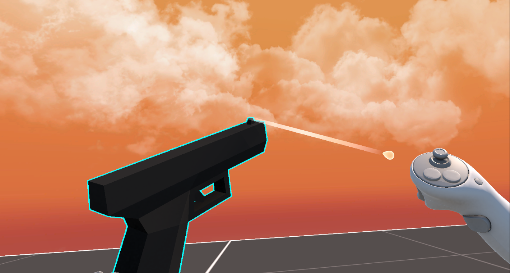
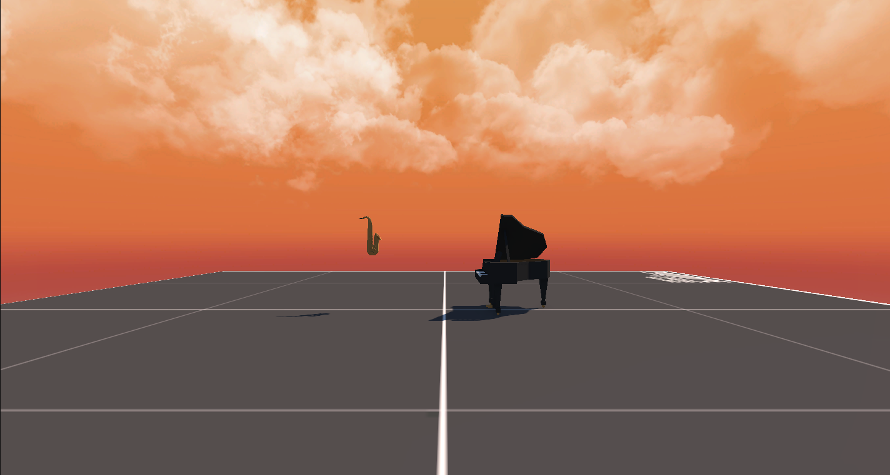

# SemantiVR 🎮🕶️

**SemantiVR** è un prototipo in **Unity 6** che genera automaticamente scenari VR **semanticamente coerenti**.  
Il progetto nasce come tesi triennale in Informatica (Università di Salerno, a.a. 2024–2025).

<p align="center">
  
</p>

---

## Introduzione
**SemantiVR** automatizza la creazione di ambienti VR combinando prefab 3D in coppie **semanticamente connesse** (es. *palla da basket* + *canestro*).  
Gli scenari risultano:
- **Interattivi fisicamente** (massa, gravità, presa, colliders)  
- **Coerenti semanticamente** grazie a **Word2Vec (GoogleNews-300)**

---

## Repository contents 📂
- `Assets/` → prefab, scene e script Unity  
- `Packages/`, `ProjectSettings/` → configurazioni Unity  
- `Assets/Scripts/` → logica C# (caricamento/validazione prefab, generazione scenari con GA, interazioni XR)  
- `Assets/Scripts/LLM/` → script Python:  
  - `load_model.py` → download/salvataggio Word2Vec GoogleNews-300  
  - `app.py` → server FastAPI per la similarità semantica  
- `Assets/Screenshots/` → immagini per il README  

---

## Dependencies & Configuration ⚙️
- **Unity 6 (Preview)** + **XR Interaction Toolkit 3.0.8**  
- **Python 3.10+**, librerie: `gensim`, `fastapi`, `uvicorn`  
- **Meta Quest 3** + **Meta Quest Link** (USB-C o Air Link)  

---

## How to run 🚀

> ⚠️ **Nota importante**  
> - ✅ **Una tantum**: installazione pacchetti Unity + download modello Word2Vec  
> - 🔁 **Ogni esecuzione**: avviare server FastAPI → avviare Unity (in questo ordine)

### 1) UNA TANTUM — Pacchetti Unity Asset Store
Installa e inserisci in `Assets/SemantiVR/`:
- [QuickOutline](https://assetstore.unity.com/packages/tools/particles-effects/quick-outline-115488)  
- [Free Stylized Hand-Painted Skybox](https://assetstore.unity.com/packages/2d/textures-materials/sky/free-stylized-hand-painted-skybox-265475?srsltid=AfmBOorK7-fxiSRxYPXJPNsdb5wNehlD5rxRZkuP8XsLCNUjoAWhNn22)  
- [Gridbox Prototype Materials](https://assetstore.unity.com/packages/2d/textures-materials/gridbox-prototype-materials-129127?srsltid=AfmBOorMg8sJt6QjXFf0V3Dvc9U_yCApKdVkZEX7hHpng_wQl5ID6cQ5)  
- [PolyPerfect Low Poly Ultimate Pack](https://assetstore.unity.com/packages/3d/props/low-poly-ultimate-pack-54733?srsltid=AfmBOope4M6PjGjD3JvoFHBMBf54aAOcCFhmTZ8ZCnw7srrBcymdWVad)  

➡️ Dal pacchetto **PolyPerfect**, trascina la cartella `Prefabs - M` in `Assets/SemantiVR/Resources/`.

### 2) UNA TANTUM — Modello Word2Vec
Esegui lo script in `Assets/Scripts/LLM/`:

```bash
cd Assets/Scripts/LLM
python load_model.py
```

Lo script scaricherà e salverà il modello **GoogleNews-300 Word2Vec** nella stessa cartella.  
Se non comparisse, posiziona manualmente il file `.model` in `Assets/Scripts/LLM/`.

### 3) OGNI VOLTA — Avvio del server semantico
Da `Assets/Scripts/LLM/` lancia:

```bash
uvicorn app:app --reload
```


Questo avvierà FastAPI e renderà disponibili gli endpoint che Unity usa per calcolare la similarità semantica.

### 4) OGNI VOLTA — Avvio del progetto Unity
- Apri Unity e carica la scena **DemoScene** in `Assets/SemantiVR/Scenes/`  
- Premi **Play**  
- Con **Meta Quest Link** attivo puoi testare tutto in VR sul visore  

---

## Demo screenshots 🖼️
<p align="center">
  
</p>

---

## Technologies used 🛠️
- **Unity 6 (URP)** – editor e rendering  
- **XR Interaction Toolkit 3.0.8** – interazioni e locomozione VR  
- **C#** – scripting logica XR  
- **Python + FastAPI** – servizio semantico  
- **gensim** – caricamento ed embedding Word2Vec  
- **uvicorn** – server ASGI per FastAPI  
- **Word2Vec (GoogleNews-300)** – embeddings semantici  
- **Mixamo** – animazioni personaggi  
- **Meta Quest 3** – testing VR  

---

## Credits 🙌
- Università degli Studi di Salerno – Dipartimento di Informatica  
- Relatore: **Prof. Fabio Palomba**

### Asset Store Packages
Per motivi di **EULA** gli asset Unity non possono essere inclusi nel repository.  
Di seguito i pacchetti utilizzati, scaricabili dall’Asset Store:  

- [QuickOutline](https://assetstore.unity.com/packages/tools/particles-effects/quick-outline-115488)  
- [Free Stylized Hand-Painted Skybox](https://assetstore.unity.com/packages/2d/textures-materials/sky/free-stylized-hand-painted-skybox-265475?srsltid=AfmBOorK7-fxiSRxYPXJPNsdb5wNehlD5rxRZkuP8XsLCNUjoAWhNn22)  
- [Gridbox Prototype Materials](https://assetstore.unity.com/packages/2d/textures-materials/gridbox-prototype-materials-129127?srsltid=AfmBOorMg8sJt6QjXFf0V3Dvc9U_yCApKdVkZEX7hHpng_wQl5ID6cQ5)  
- [PolyPerfect Low Poly Ultimate Pack](https://assetstore.unity.com/packages/3d/props/low-poly-ultimate-pack-54733?srsltid=AfmBOope4M6PjGjD3JvoFHBMBf54aAOcCFhmTZ8ZCnw7srrBcymdWVad)   *(include `Prefabs - M`)*  

> ℹ️ **Nota**: in futuro è previsto lo sviluppo di **asset personalizzati**, così da evitare la necessità di importare pacchetti esterni.

### Frameworks & librerie
- **XR Interaction Toolkit 3.0.8**  
- **gensim**, **fastapi**, **uvicorn**  
---
